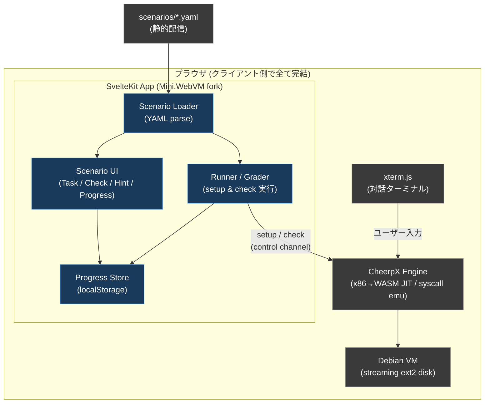
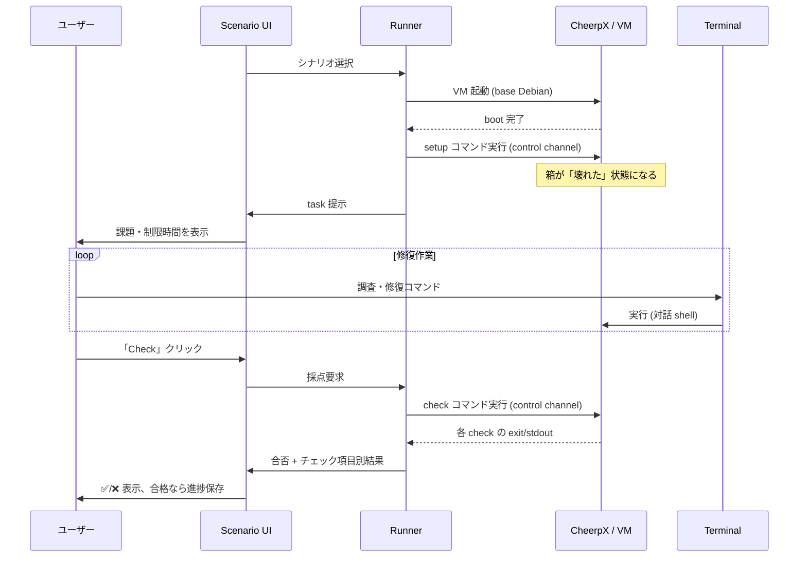

# Linux学習環境 (Web版) — Spec.md

**Project**: Browser-based Linux Troubleshooting Trainer (SadServers-inspired)
**Layer**: 2層構成のうち **Layer 1 (万人向け・ブラウザ完結)**
**Author**: HolmesJP
**Status**: Design locked / 個人学習用途 MVP
**Engine**: WebVM (CheerpX) — 無料枠・非商用

---

## 0. この文書について

本プロジェクトは Linux 学習プラットフォームの2層構成のうち **Layer 1** を扱う。

- **Layer 1 (本書)**: Linux の基礎・ログ解析。ブラウザ完結。サーバー側計算ゼロ。
- **Layer 2 (別プロジェクト)**: セキュリティ/ペネトレーションテスト。ローカル実VM (VirtualBox + Vagrant)。既存「やられサーバー」資産を流用。本書では扱わない。

### 前提の共有 (最重要の認識)

**ブラウザで Linux を動かす部分は、WebVM (CheerpX) が既に解決済みのコモディティである。**
CheerpX は x86→WebAssembly の JIT コンパイラ + Linux syscall エミュレータ + 仮想ブロック FS で、改変なしの Debian をブラウザ内で丸ごと動かす。**ここは我々が作るものではない。**

**我々が設計・実装するのは「シナリオのライフサイクル」である。**
SadServers の価値は「ブラウザの中の Linux」ではなく、キュレーションされた壊れたシナリオ群と採点機構にある。開発エネルギーはここに集中させる。

---

## 1. ゴールとスコープ

### 1.1 目的

こちらが用意したシナリオ (壊れた Linux サーバー) を、ユーザーがブラウザ上で調査・修復し、修復できたかを自動採点する学習環境。インストール不要、URL を開くだけ。

### 1.2 MVP スコープ (個人学習用途)

- 単一の Debian 系イメージをブラウザ内で起動
- YAML manifest で定義したシナリオを読み込み、起動時に「壊す」
- ユーザーが対話ターミナルで修復
- 「Check」で修復完了を自動判定 (合否 + チェック項目別の可視化)
- 進捗を localStorage に保存
- シナリオ 3〜5 本で一周体験が完成すること

### 1.3 非スコープ (MVP では作らない)

- 認証・ユーザー管理・サーバーサイド DB (localStorage のみ)
- 課金・商用機能 (良さそうなら後で検討)
- Layer 2 (セキュリティ/ローカルVM) の一切
- ネットワーク系シナリオ (§9 参照。ブラウザの制約上、後回し)
- マルチユーザー同時利用の最適化

---

## 2. アーキテクチャ

### 2.1 全体像



濃色 = 我々が作る部分。灰色 = WebVM/CheerpX が提供済みの部分。

### 2.2 プラットフォームの正体は3つの仕組み

SadServers 的な「1台を壊して直す」形式は、次の3つに分解できる。

1. **壊れた初期状態の注入 (setup)** — WebVM は標準 Debian で起動する。シナリオにするには起動後に「壊す」。**採用方式: 1つのベースイメージ + 起動時 setup スクリプト** (壊れたイメージを個別に焼く方式は不採用。理由 §2.5)。
2. **対話による修復 (作らない)** — xterm.js のターミナルがそのまま担う。実装不要。
3. **採点・検証 (check)** — 「直ったか」を判定。CheerpX がクライアント側で動くので採点もクライアント側で完結。チェック用コマンドを VM 内で実行し、出力を App が読む。

### 2.3 コンポーネント構成

| Component | 役割 | 新規/既存 |
|---|---|---|
| CheerpX Engine | Linux VM の実行 | **既存** (NPM) |
| xterm.js Terminal | 対話ターミナル | **既存** (fork に同梱) |
| Debian Disk Image | ベース OS | 既存パイプラインで**ビルド** |
| Scenario Loader | YAML manifest の parse | **新規** |
| Runner | setup/check コマンドの実行 | **新規** |
| Grader | check 結果の合否判定 | **新規** |
| Scenario UI | Task/Check/Hint/Solution パネル | **新規** |
| Progress Store | 進捗の localStorage 永続化 | **新規** |

### 2.4 データフロー (起動→修復→採点)



### 2.5 なぜ「ベースイメージ + setup スクリプト」方式か

- **シナリオ資産が流用できる**: QNAP コンテナ版で書いた YAML manifest の構造 (setup/check/task) がほぼそのまま乗る。エンジン非依存。
- **軽い**: シナリオごとに巨大な壊れたディスクを焼かず、ベース1個 + 数十行のスクリプトで済む。CheerpX の streaming disk と相性が良い。
- **リセットが容易**: 再挑戦は「fresh boot → setup 再実行」で戻せる。

---

## 3. 技術スタック

| 層 | 採用 | 備考 |
|---|---|---|
| 仮想化エンジン | **WebVM / CheerpX** (無料枠) | NPM package。非商用・セルフホスト制約あり (§10) |
| ベース OS | **Debian 系** | systemd/journald/apt のリアリズム重視。ただし §9 の systemd 検証を通ること |
| ベースアプリ | **Mini.WebVM を fork** | SvelteKit。ターミナル・サイドバー・Dockerfile→image パイプライン同梱 |
| フレームワーク | **Svelte + SvelteKit** (fork 準拠) | static adapter で完全クライアントサイド |
| 言語 | **TypeScript** | |
| YAML parse | **js-yaml** | |
| 状態管理 | **Svelte stores + localStorage** | MVP はバックエンド無し |
| ターミナル | **xterm.js** (fork 同梱) | |

---

## 4. シナリオ manifest 仕様

### 4.1 YAML スキーマ (完全な例)

```yaml
# scenarios/sshd-down/manifest.yaml
id: sshd-down                      # 一意な slug (ディレクトリ名と一致)
title: "sshd won't start"
difficulty: easy                   # easy | medium | hard
category: services                 # filesystem | permissions | processes | disk | services | logs
time_estimate_min: 10

description: |
  この Debian サーバーでは SSH デーモンが起動していない。
  ユーザーが SSH 接続できるよう、原因を調査し sshd を起動せよ。

# --- 起動時に一度だけ実行し、箱を「壊す」 ---
# 冪等であること (reload / 再挑戦で二重実行されても壊れない)
setup:
  - description: "corrupt sshd config"
    cmd: |
      # 冪等: 既にバックアップがあれば上書きしない
      [ -f /etc/ssh/sshd_config.orig ] || cp /etc/ssh/sshd_config /etc/ssh/sshd_config.orig
      sed -i 's/^#\?Port 22/Port 22\nInvalidDirective yes/' /etc/ssh/sshd_config
      systemctl stop ssh 2>/dev/null || true

# --- 修復完了の判定。全 check が pass で合格 ---
# 「最終状態」で判定する (ユーザーのコマンド履歴を見ない)
check:
  - description: "sshd プロセスが active である"
    test: "systemctl is-active ssh"
    expect_exit: 0                 # exit code で判定
  - description: "22番ポートで listen している"
    test: "ss -tlnp | grep -q ':22 '"
    expect_exit: 0

# --- 段階的ヒント (1つずつ開示) ---
hints:
  - "サービスの状態を確認: systemctl status ssh"
  - "ジャーナルを追う: journalctl -u ssh --no-pager"
  - "設定を検証: sshd -t"

# --- 参考解答 (ユーザーが要求 or 諦めたときに開示) ---
solution: |
  /etc/ssh/sshd_config に不正なディレクティブ (InvalidDirective) が混入している。
  `sshd -t` で構文エラーが出る。該当行を削除し `systemctl restart ssh` で復旧。
```

### 4.2 フィールド定義

| フィールド | 必須 | 説明 |
|---|---|---|
| `id` | ✔ | 一意 slug。ディレクトリ名と一致 |
| `title` | ✔ | 短い題名 |
| `difficulty` | ✔ | `easy` / `medium` / `hard` |
| `category` | ✔ | §4.5 のカテゴリ |
| `time_estimate_min` | | 目安時間 (分) |
| `description` | ✔ | 課題文 (ユーザーに提示) |
| `setup` | ✔ | 壊す手順。`{description, cmd}` の配列 |
| `check` | ✔ | 判定手順。§4.3 の契約に従う配列 |
| `hints` | | 段階ヒント (文字列配列) |
| `solution` | | 参考解答 |

### 4.3 check の判定契約

各 check は 1コマンドを VM 内で実行し、次のいずれかで pass/fail を決める。**優先度順に最初に指定されたものを使用**:

| キー | 判定 |
|---|---|
| `expect_exit: <int>` | コマンドの exit code が一致すれば pass |
| `expect_stdout_contains: "<str>"` | 標準出力に部分文字列を含めば pass |
| `expect_stdout_regex: "<regex>"` | 標準出力が正規表現にマッチすれば pass |
| `expect_stdout_equals: "<str>"` | 標準出力 (trim 後) が完全一致で pass |

`description` は UI にチェックリスト項目として表示し、pass/fail を ✅/❌ で可視化する。

各 check は任意で `run_as: root | user` を指定できる (省略時 `root`)。`user` は uid 1000 として実行し、「一般ユーザーの視点で直ったか」(読める・実行できる等) を検証する用途。M1 で判明した CheerpX の制約 (非 root ユーザーは所有ファイルでも chmod 不可) により、権限系の check は「root で状態を見る」か「user で実際に試す」かを明示的に選ぶ必要があるため導入した (2026-07-04 追記)。

### 4.4 設計原則 (manifest 作成時の鉄則)

1. **冪等性 (idempotent)**: `setup` と `check` は二重実行されても壊れない。既存の「やられサーバー」流儀 (`id user || useradd`、`REPLACE INTO`、`[ -f backup ] || cp`) をそのまま適用する。ブラウザの reload / 再挑戦で setup が再走しても安全なこと。
2. **最終状態で判定 (check final state)**: 「sshd を起動せよ」を、ユーザーが打ったコマンド文字列で判定しない。`systemctl is-active ssh` のような**現在の状態**で判定する。直し方は何通りあってよい。
3. **1シナリオ完走を最初に**: 量産前に、最小のシナリオで「壊す→直す→✅」の一周を必ず通す (§8 M1)。

### 4.5 カテゴリ

`filesystem` / `permissions` / `processes` / `disk` / `services` / `logs`

> **注**: `services` と `logs` は systemd/journald 前提。§9 の systemd 検証が通るまで、`filesystem` / `permissions` / `processes` / `disk` を優先する。

---

## 5. 実行エンジン (Runner / Grader)

### 5.1 control channel と対話ターミナルの分離 (推奨)

`setup` / `check` のコマンドは、**ユーザーの対話ターミナルとは別の control channel** で実行する。理由:

- ユーザーが check のノイズ (隠しコマンドの出力) を見ずに済む
- ユーザーの入力途中に setup が割り込まない

CheerpX の filesystem は共有されているため、別プロセスで `systemctl is-active ssh` を実行しても、ユーザーが対話 shell で行った変更が反映された同じ状態を見られる。

> **実装上の最重要確認 (§9)**: CheerpX が「対話ターミナルとは独立にプロセスを起動し、exit code と stdout を取得する API」を提供するか、実ソース/公式 docs で必ず確認する。**API を推測でコードに書かないこと。**

### 5.2 フォールバック: sentinel 方式

独立チャンネルが綺麗に取れない場合、**隠し shell に sentinel (区切り文字) を挟んでコマンドを注入**し、ターミナル出力から該当区間を切り出す。これは WebVM の Claude 連携が bash ツールで実際に使っている手法 (コマンド出力を sentinel ベースでターミナルからパース) と同じ。exit code は `echo "___EXIT_$?_SENTINEL___"` の形で回収する。

### 5.3 setup 実行タイミング

VM の boot 完了後、ユーザーに task を提示する**前**に setup を流す。boot 完了フックの取り方も §9 で確認する項目。

### 5.4 採点フロー

```
onCheckClick():
  results = []
  for c in scenario.check:
    { exitCode, stdout } = runInControlChannel(c.test)
    results.push(evaluate(c, exitCode, stdout))   # §4.3 の契約
  passed = results.every(r => r.pass)
  UI.render(results)
  if passed: ProgressStore.markComplete(scenario.id)
```

---

## 6. UI 構成

Mini.WebVM のレイアウト (ターミナル + サイドバー) に、以下のパネルを追加する。

| パネル | 内容 |
|---|---|
| **Task Panel** | title / difficulty / category / time_estimate / description |
| **Check Panel** | 「Check」ボタン + チェック項目リスト (各 description に ✅/❌) |
| **Hint Panel** | ヒントを1つずつ開示 (「次のヒント」ボタン) |
| **Solution Panel** | solution を要求時に開示 (段階を踏ませる: 諦める確認 → 表示) |
| **Scenario List** | 利用可能シナリオ一覧 (難易度・カテゴリ・完了バッジ) |
| **Progress** | 完了数 / 全体、localStorage 由来の完了状態 |

**Reset ボタン**: 現シナリオを fresh boot + setup 再実行で初期化。

---

## 7. ディレクトリ構造

```
linux-trainer-web/
├── Spec.md                       # 本書
├── CLAUDE.md                     # Claude Code 用の作業指示
├── scenarios/
│   ├── sshd-down/
│   │   └── manifest.yaml
│   ├── disk-full/
│   │   └── manifest.yaml
│   └── ...
├── docker/
│   └── Dockerfile                # ベース Debian イメージ定義 (ツール込み)
├── src/                          # forked Mini.WebVM (SvelteKit)
│   ├── lib/
│   │   ├── scenario/             # ★ 新規実装の中核
│   │   │   ├── loader.ts         # YAML → Scenario 型
│   │   │   ├── runner.ts         # CheerpX control channel での setup/check 実行
│   │   │   ├── grader.ts         # check 契約の評価 (§4.3)
│   │   │   └── types.ts          # Scenario / Check / Result 型定義
│   │   ├── components/
│   │   │   ├── TaskPanel.svelte
│   │   │   ├── CheckPanel.svelte
│   │   │   ├── HintPanel.svelte
│   │   │   ├── SolutionPanel.svelte
│   │   │   └── ScenarioList.svelte
│   │   └── stores/
│   │       └── progress.ts       # localStorage 永続化
│   └── routes/                   # fork 既存
├── static/                       # fork 既存
└── (fork 由来のビルド設定一式)
```

---

## 8. 開発マイルストーン

**縦切り優先。広げる前に串を通す。**

| # | マイルストーン | 完了条件 (Definition of Done) |
|---|---|---|
| **M0** | **検証スパイク** | §9 の必須項目を実機で確認。特に (a) systemd が init で動くか、(b) CheerpX の programmatic 実行 API、(c) COOP/COEP 設定でブラウザ起動、(d) fork がビルド&ブラウザで Debian が起動する。**シナリオ機能はまだ書かない。** |
| **M1** | **縦切り1本 (最重要)** | **ハードコードした 1 シナリオ**で「boot → setup で壊す → ユーザーが直す → Check で ✅」の一周が通る。control channel パターンをここで確立。ここが通れば残りは量産、通らなければ設計に穴。 |
| **M2** | **YAML 外部化** | M1 のハードコードを `manifest.yaml` + `loader.ts` に移す。同じシナリオが YAML 経由で動く。 |
| **M3** | **UI パネル** | Task / Check (チェックリスト) / Hint / Solution パネルを実装。 |
| **M4** | **選択 + 進捗** | Scenario List + Progress (localStorage)。シナリオ 3〜5 本を追加し、選択→挑戦→完了記録が回る。 |
| **M5** | **量産・磨き込み** | Reset、シナリオ追加、UX 調整。 |

---

## 9. 技術リスクと検証項目 (M0 で最優先に潰す)

| # | 項目 | なぜ重要か | 対応 |
|---|---|---|---|
| **R1** | **systemd が init (PID 1) で動くか** | Docker 由来イメージは通常 systemd を init で動かさない。動かないと `systemctl`/`journalctl` 系シナリオ (services/logs) が成立せず、Debian 採用の根拠 (リアリズム) が弱まる。 | **M0 で実機確認。** 動く: そのまま。動かない: ①systemd 有効化イメージを使う、②sysvinit/直接デーモン管理で代替、③まず filesystem/permissions/processes/disk カテゴリから始め services/logs は後追い。**本書はこの不確実性を明示しており、確認前に systemd 前提シナリオを量産しない。** |
| **R2** | **CheerpX の programmatic 実行 API** | setup/check を対話ターミナルと分離して実行する必要がある (§5.1)。API 表面が不明。 | **実ソース (Mini.WebVM) / 公式 docs で確認。推測で書かない。** 独立プロセス API が無ければ §5.2 sentinel 方式にフォールバック。 |
| **R3** | **cross-origin isolation (COOP/COEP)** | CheerpX は SharedArrayBuffer に依存し、`Cross-Origin-Opener-Policy` / `Cross-Origin-Embedder-Policy` ヘッダと HTTPS が必須。未設定だと初期化失敗。 | dev サーバーとホスティング (GitHub Pages 等) の両方で COOP/COEP を設定。既知の頻出エラーなので M0 で通す。 |
| **R4** | **永続化 vs リセット** | CheerpX には persistence 層があるが、シナリオはセッションごとにリセットしたい (再挑戦のため)。永続化が意図せず効くと前回の破壊状態が残る。 | シナリオ VM 状態は**リセット前提**で設計。永続化の挙動を確認し、必要なら無効化 or fresh boot を強制。 |
| **R5** | **性能・重い処理** | JIT で実用的だがネイティブより遅い。重い GUI は不可 (Firefox はインストールできても起動不可の報告あり)。 | CLI 中心の Layer 1 なら問題なし。シナリオは重量級 GUI/巨大処理を避ける。起動が重ければ基礎シナリオを軽量イメージ (Alpine) に逃がす後退路を残す。 |
| **R6** | **ネットワーク制約** | ブラウザは TCP/UDP を直接扱えず、WebVM は Tailscale 経由でのみ外部通信、ping (ICMP) も不可。 | **Layer 1 では基礎/ログ解析が中心で外部ネットワーク不要**なため、この弱点は実質効かない。ネットワーク系シナリオは非スコープ (§1.3)。 |

---

## 10. ライセンス境界 (忘れないための記録)

- WebVM は Apache 2.0 でリポジトリ公開。ただし **公開 CheerpX デプロイは「個人の技術探求・テスト・非商用」のみ無料**。
- **組織利用 (非営利・学術・公共を含む) や、CheerpX ビルドを他所でホストするには商用ライセンスが必要。** 製品化するなら `sales@leaningtech.com` に連絡と明記されている。
- **本 MVP は個人・非商用のため無料枠内。** GitHub Pages への fork デプロイ (WebVM 公式と同方式) は個人利用の範囲。
- **商用化を検討する段階で、この制約の金額感を確認してから判断する** (代替: v86 はよりゆるいライセンスだが完全エミュレーションで遅い / 自前 ephemeral コンテナ方式)。

---

## 11. 用語

| 用語 | 意味 |
|---|---|
| **Layer 1 / Layer 2** | 本プロジェクト (ブラウザ基礎) / 別プロジェクト (ローカルVM セキュリティ) |
| **CheerpX** | x86→WASM の仮想化エンジン。WebVM の心臓部 |
| **manifest** | シナリオ定義 YAML (setup/check/task/hints/solution) |
| **setup** | 起動時に箱を「壊す」冪等なコマンド群 |
| **check** | 修復完了を「最終状態」で判定するコマンド群 |
| **control channel** | 対話ターミナルと分離した、setup/check 実行用の経路 |
| **sentinel 方式** | 隠し shell に区切り文字を挟んでコマンド注入し出力を切り出すフォールバック |
| **縦切り (vertical slice)** | 1シナリオを端から端まで先に通す開発戦略 (M1) |
